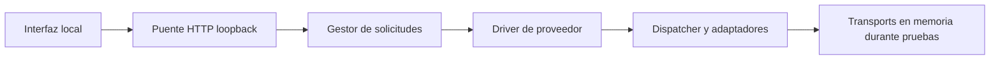

# Arquitectura

La interfaz y el runtime se separan para que una conversación visible no se convierta por sí sola en permiso para actuar.

## Capas

| Ruta | Responsabilidad |
| --- | --- |
| `apps/ui/js/db.js` | Persistencia local del navegador |
| `apps/ui/js/app.js` | Agentes, chats, navegación y contexto |
| `apps/ui/motor.js` | Contrato cliente del puente local |
| `packages/runtime/vendor/bridge/` | Inventario estático exacto, contratos HTTP y ciclo de solicitudes |
| `packages/runtime/src/provider-driver.mjs` | Un turno activo, enrutamiento y tratamiento de cancelación |
| `packages/runtime/vendor/engine/` | Adaptadores de protocolo, dispatcher y límites de transporte |

## Preview público

`tools/preview.mjs` construye una configuración nueva, con rutas relativas al repositorio y ambos proveedores deshabilitados. No carga `local-config.json` ni variables que habiliten proveedores. Los assets permitidos están ligados a hashes de esta copia pública.

Los pins de `src/ui-pins.mjs` fueron recalculados para los seis assets publicados. No son una aprobación del entorno privado ni los pins de aquella instalación. La configuración de ejemplo es inerte; el preview no la usa para introducir permisos.

El puerto predeterminado es 8787. La interfaz guarda datos por origen; un perfil vacío evita mezclar pruebas con conversaciones de otros entornos. Un conflicto de puerto falla, sin buscar ni detener procesos ajenos.

## Lo que no se afirma

- Ningún proveedor real fue invocado para verificar esta entrega.
- Los mocks comprueban el comportamiento frente a sus fixtures, no la disponibilidad ni las condiciones de un producto externo.
- Una respuesta de estado del puente no implica que exista una sesión de IA.
- El adaptador experimental no forma parte del camino del preview.
